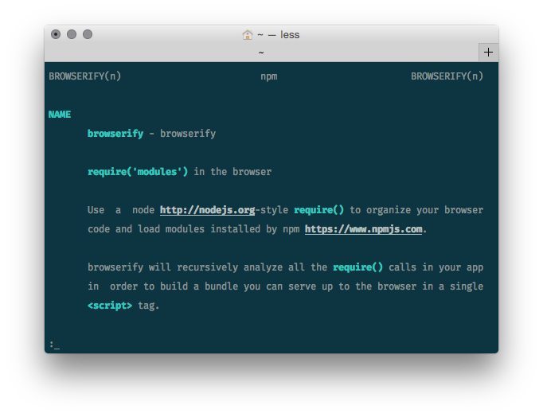

# man-n
View npm package READMEs with `man(1)`.



## Installation
```sh
$ npm install -g man-n
```

## Usage
```sh
$ man-n <package>
```

## License
[MIT](https://tldrlegal.com/license/mit-license)
