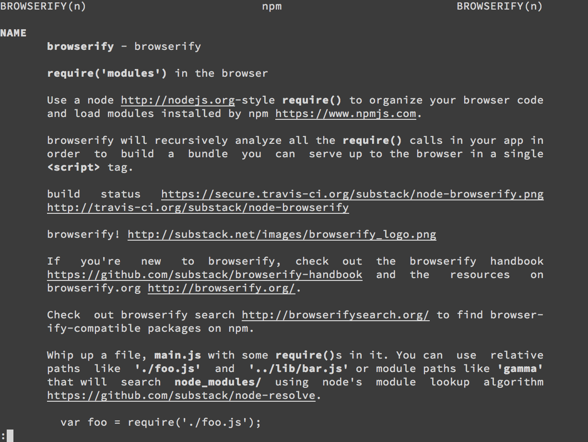

# man-n
View npm package READMEs with `man(1)`.



## Installation
```sh
$ npm install -g man-n
```

## Usage
```sh
$ man-n -h
  Usage: man-n [options] <package>

  Options:

    -h, --help  output usage information
    -l, --link  default to man(1)

  Examples:

    $ man-n browserify          # show browserify docs
```

## Aliasing

Tired of typing that dash? Add the following to your `.bashrc`,
`.bash_profile`, or `.zshrc`

```sh
# Link `man-n` to `man`
$ alias "man=man-n --link"
```

...and from now on, you can just type `man n` to access package
documentation.

## License
[MIT](https://tldrlegal.com/license/mit-license)
